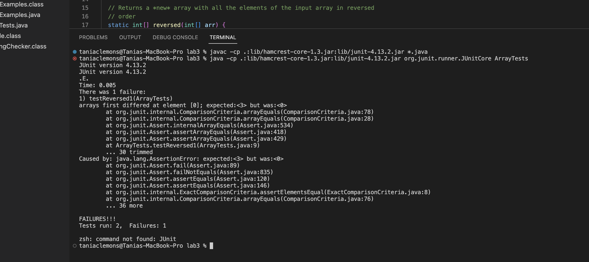

# Part 1 - Bugs

Junit Tests:
```
@Test
  public void testReversed1(){
    //Test w/ a failure-inducing input for the buggy program
    int[] input1 = { 1, 2, 3};
    assertArrayEquals(new int[]{3, 2, 1}, ArrayExamples.reversed(input1));
  }

  @Test
  public void testReversed2(){
    //Test w/ an input that doesn’t induce a failure
    int[] input1 = { };
    assertArrayEquals(new int[]{ }, ArrayExamples.reversed(input1));
  }
```


Symptom:



Before and After Reversed Method Code:
```
static int[] reversed(int[] arr) {
    int[] newArray = new int[arr.length];
    for(int i = 0; i < arr.length; i += 1) {
      arr[i] = newArray[arr.length - i - 1];
    }
    return arr;
  }

static int[] reversed(int[] arr) {
    int[] newArray = new int[arr.length];
    for(int i = 0; i < arr.length; i += 1) {
      newArray[i] = arr[arr.length - i - 1];
    }
    return newArray;
  }
```

The fix addresses the issue of the buggy program returning the original array instead of the new one. It also makes it so the new array is the one getting changed within the for loop in order to return a new separate array with all the elements of the input array in reverse order.


# Part 2 - Researching Commands

**grep -c**
```
taniaclemons@Tanias-MacBook-Pro docsearch % grep -c "Postal Service" ./technical/government/Post_Rate_Comm/Redacted_Study.txt
34

taniaclemons@Tanias-MacBook-Pro docsearch % grep -c "Postal Service" ./technical/government/Post_Rate_Comm/*
./technical/government/Post_Rate_Comm/Cohenetal_Cost_Function.txt:3
./technical/government/Post_Rate_Comm/Cohenetal_CreamSkimming.txt:50
./technical/government/Post_Rate_Comm/Cohenetal_DeliveryCost.txt:1
./technical/government/Post_Rate_Comm/Cohenetal_RuralDelivery.txt:26
./technical/government/Post_Rate_Comm/Cohenetal_Scale.txt:49
./technical/government/Post_Rate_Comm/Cohenetal_comparison.txt:24
./technical/government/Post_Rate_Comm/Gleiman_EMASpeech.txt:25
./technical/government/Post_Rate_Comm/Gleiman_gca2000.txt:22
./technical/government/Post_Rate_Comm/Mitchell_6-17-Mit.txt:29
./technical/government/Post_Rate_Comm/Mitchell_RMVancouver.txt:71
./technical/government/Post_Rate_Comm/Mitchell_spyros-first-class.txt:17
./technical/government/Post_Rate_Comm/Redacted_Study.txt:34
./technical/government/Post_Rate_Comm/ReportToCongress2002WEB.txt:82
./technical/government/Post_Rate_Comm/WolakSpeech_usps.txt:1
```
The -c command-line option allows you to see the count of the number of matching lines with the given argument. This is useful because it’s more efficient to just see the number instead of the printed matching line when you want to see the frequency of a word being used.

*Source*: https://en.wikibooks.org/wiki/Grep


**grep -i**
```
taniaclemons@Tanias-MacBook-Pro docsearch % grep -i "counterterrorism" ./technical/9
11report/chapter-8.txt
            As 2001 began, counterterrorism officials were receiving frequent but fragmentary
                National Security Council (NSC) counterterrorism coordinator, all received the SEIB,
            The interagency Counterterrorism Security Group (CSG) that Clarke chaired discussed
                out several more if things went well. On May 24 alone, counterterrorism officials
            On July 2, the FBI Counterterrorism Division sent a message to federal agencies and
            The head of counterterrorism at the FBI, Dale Watson, said he had many discussions
                Counterterrorism Division at FBI headquarters.
            The search was assigned to one FBI agent, and it was his very first counterterrorism
                for Counterterrorism Dale Watson was briefed on the Moussaoui case prior to 9/11.

taniaclemons@Tanias-MacBook-Pro docsearch % grep -i "counterterrorism investigation" ./technical/911report/*
./technical/911report/chapter-13.1.txt:                Counterterrorism investigations in the United States very quickly become
./technical/911report/chapter-13.1.txt:                Counterterrorism investigations often overlap or are cued by other criminal
./technical/911report/chapter-13.4.txt:            Bayoumi was once the subject of an FBI counterterrorism investigation, prompted by
./technical/911report/chapter-13.4.txt:                have both been the subject of FBI counterterrorism investigations. The
```
The -i command-line option makes it so it ignores the uppercase and lowercase differences of the argument when finding matching patterns. It’s useful because it makes the argument more inclusive without having to add more to it.

*Source*: https://en.wikibooks.org/wiki/Grep


**grep -n**
```
taniaclemons@Tanias-MacBook-Pro docsearch % grep -n "environmental" ./technical/plos/journal.pbio.0020019.txt
7:        given the amount of environmental variation they encounter during development and the
10:        environmental variation (Waddington 1942). Clearly, such a mechanism would have important
16:        genetic or environmental circumstances, then the stored genetic variation will be released,
31:        (4) this function may be compromised by environmental factors, e.g., heat shock.
38:        stabilisation and environmental coupling such as those provided by Hsp90 (Siegal and
58:        changed from on to off or vice versa (i.e., there was a shift in the environmental
65:        be linked to an environmental change in order to be beneficial.
68:        response to environmental or genetic change, are not unique to Hsp90. Indeed, the
71:        by an environmental change, but can be produced by a gene ‘knockout’. These results may go
128:        genetic and environmental variation. The stabilisation of neural activity may have

taniaclemons@Tanias-MacBook-Pro docsearch % grep -n "excessive" ./technical/government/Alcohol_Problems/* 
./technical/government/Alcohol_Problems/DraftRecom-PDF.txt:81:The problem is the consequences resulting from excessive
./technical/government/Alcohol_Problems/Session2-PDF.txt:580:A. Screening for excessive alcohol drinking: comparative value of
./technical/government/Alcohol_Problems/Session3-PDF.txt:243:and patient plans to address excessive drinking. Prototypic
./technical/government/Alcohol_Problems/Session3-PDF.txt:723:for excessive drinkers: the need for caution. Alcohol Alcohol
./technical/government/Alcohol_Problems/Session3-PDF.txt:1045:excessively. Second, the ED is a fast-paced environment in which
```
The -n command-line option includes the line number in the output of the matching lines with the given pattern. It’s useful because it makes it easier to find the argument within the actual text.

*Source*: https://en.wikibooks.org/wiki/Grep


**grep -l**
```
taniaclemons@Tanias-MacBook-Pro docsearch % grep -l "divorce" ./technical/government/Media/Abuse_penalties.txt ./technical/government/Media/BusinessWire.txt ./technical/government/Media/Do-it-yourself_divorce.txt
./technical/government/Media/Do-it-yourself_divorce.txt

taniaclemons@Tanias-MacBook-Pro docsearch % grep -l "counterterrorism" ./technical/9
11report/*
./technical/911report/chapter-1.txt
./technical/911report/chapter-10.txt
./technical/911report/chapter-11.txt
./technical/911report/chapter-12.txt
./technical/911report/chapter-13.1.txt
./technical/911report/chapter-13.3.txt
./technical/911report/chapter-13.4.txt
./technical/911report/chapter-13.5.txt
./technical/911report/chapter-3.txt
./technical/911report/chapter-6.txt
./technical/911report/chapter-7.txt
./technical/911report/chapter-8.txt
```
The -l command-line option only returns the matching files with the given pattern instead of the lines. It’s useful for when you just want to know which files to find the argument instead of the lines.

*Source*: https://en.wikibooks.org/wiki/Grep
